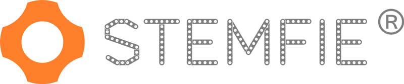
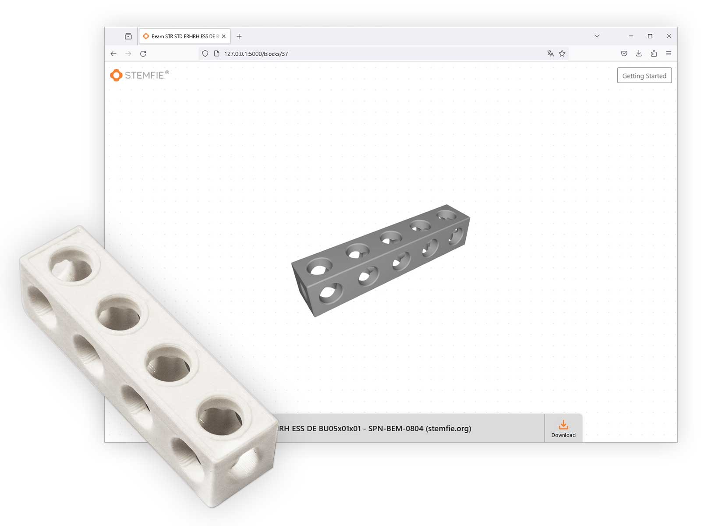
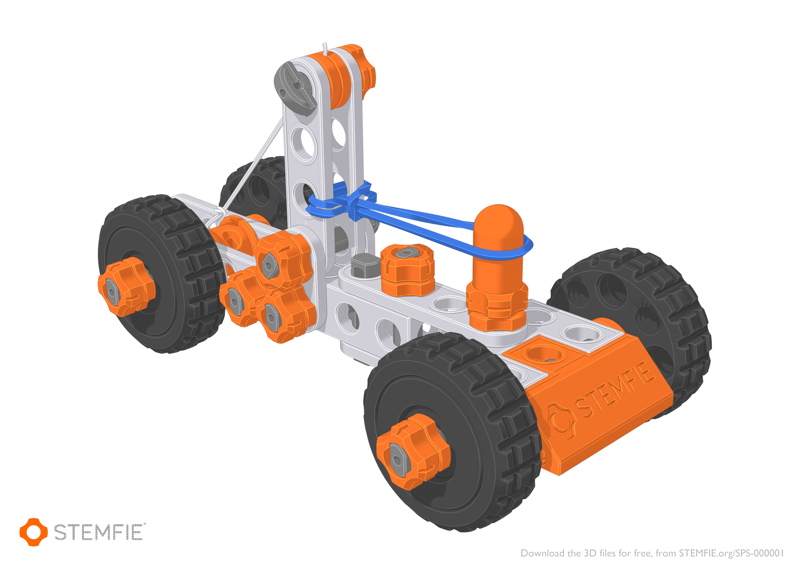

# STEMFIE Platform
This is the 3D Online Platform for the FreeCAD-build construction set STEMFIE! The STEMFIE construction set can be 3D printed at home with your own 3D printer and has been optimized for 3D printing.

Beginning in July 2023, we have been working to create a way for browsing and downloading all the STEMFIE parts that would capture the magic we had when buying LEGO boxes in the physical store.

We already have countless ideas of what this can become in the future and we are dedicated to adding more and more features to it and expanding the entire ecosystem (e.g. Just like the STEMFIE color branded filament).

## Build STEMFIE Projects
The STEMFIE rubber-band-driven car is easy and quick to build and demonstrates energy retention and controlled release to achieve motion. The inspiration for this design is borrowed from science classes in schools, using the mousetrap car.

## Getting Started
[All steps required to reproduce this platform locally on Windows and Ubuntu]

## Vision
[Descirbe what our goal with the STEMFIE platform is and how it related to the STEMFIE project longterm]
